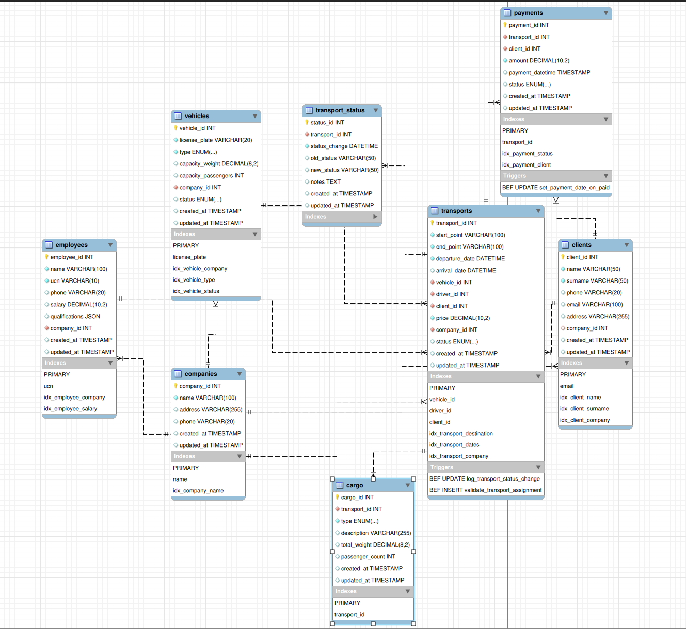

# Project Transport Company

## Functionality:
      1.Entering, editing and deleting a transport company that provides transport services and employs employees
      2. Entering, editing and deleting the transport company's clients
      3. Entering, editing and deleting the vehicles owned by
         a company
      4. Entering, editing and deleting the company's employees.
      5. Ability to record data about the transports (destination, cargo, price, etc.)
      6. A way to record this if the client has paid the obligations.
      7. Sorting and filtering the data by various criteria:
         a. For companies by name and revenue.
         b. For employees by qualification and salary.
         c. For transports by destination.
      8. Saving the transport data in a file and the ability to retrieve and
         display this data.
      9. Display reports on the total number of transportations performed, the total amount of transportations performed, a list of drivers and how many transportations each of them has performed, the company's revenue for a certain period of time, how much revenue each of the drivers generates, etc.

## DB Schema



## DB in docker container
compose.yaml is for creating a docker compose container with required passwords.


## DB migration tool - liquibase
I am using liquibase to apply DB schema and demo data.
path to liquibase changelog: ./src/main/resources/db/changelog/
to download liquibase (If it is not installed already) you can download it locally using `download-liquibase.sh`
and after that to apply changes use this command:
``` bash
cd src/main/resources/db
./liquibase/liquibase update
```


